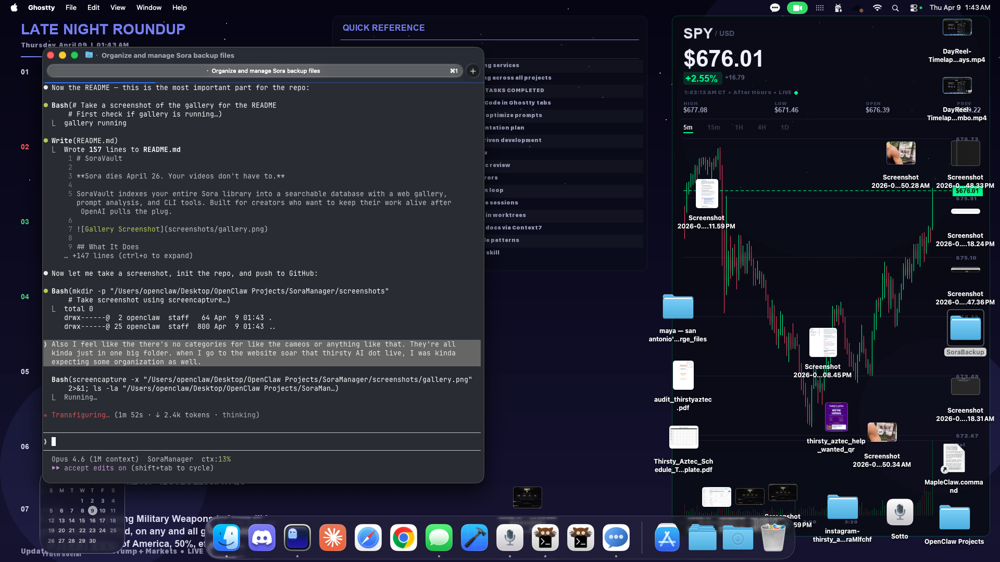

# SoraVault

**Sora dies April 26. Your videos don't have to.**

SoraVault indexes your entire Sora library into a searchable database with a web gallery, prompt analysis, and CLI tools. Built for creators who want to keep their work alive after OpenAI pulls the plug.



## What It Does

- **Full-text search** across all prompts, captions, and cameo names
- **Web gallery** with hover-to-play, starring, filtering by source/engagement
- **Prompt analysis** — which keywords, cameos, and prompt lengths drive the most engagement
- **CLI search** — find any video from your terminal
- **Highlight reel compiler** — auto-stitch your best videos with ffmpeg
- **Vision analysis** (optional) — Claude Haiku describes every scene, mood, and text on screen
- **Watermark removal** — batch cleanup using SoraWatermarkCleaner

## Quick Start

### 1. Download your Sora library

Use [SoraVault Tampermonkey script](https://github.com/charyou/SoraVault) or [save-sora](https://github.com/alpha1337/save-sora) to bulk download your videos and prompts. You need the folder structure:

```
~/SoraBackup/
├── v2_feed/
│   ├── videos/    (*.mp4)
│   └── prompts/   (*.md)
├── v2_draft/
│   ├── videos/
│   └── prompts/
├── cameos/        (optional)
│   ├── character_name/
│   │   ├── videos/
│   │   └── prompts/
└── manifest.json  (optional, adds engagement stats)
```

### 2. Install & Index

```bash
git clone https://github.com/thirstyaztec/SoraVault.git
cd SoraVault
python3 -m venv .venv && source .venv/bin/activate
pip install -r requirements.txt

# Point to your backup (default: ~/Desktop/SoraBackup)
export SORA_BACKUP_DIR=~/path/to/your/SoraBackup

# Index everything
python3 indexer.py
```

### 3. Launch Gallery

```bash
python3 gallery_server.py
# Open http://localhost:5060
```

### 4. Search from CLI

```bash
python3 search.py find "riverwalk margarita"
python3 search.py top -n 20
python3 search.py stats
python3 search.py keywords
python3 search.py play <video_id>
```

## Features

### Search & Discovery

Full-text search across prompts, captions, and cameo names. Filter by source (feed/draft), minimum likes, video-only. Sort by engagement, date, duration, or relevance.

```
$ python3 search.py find "riverwalk margarita"
ID                                            Likes  Views   Dur Source     Caption
[V] s_68e70b8688208191a6c63026338de1a8            10     29   10s v2_feed   @thirstyai on shark tank pitching...
[V] s_68e30821d82481919fe81710081b7c09             9     22   10s v2_feed   I want someone running on the...
```

### Prompt Analysis

Discover what actually works. Analyze keywords, cameo combinations, prompt lengths, and generation types by engagement.

```
$ python3 analyze.py

=== Prompt Length vs Performance ===
Length                Count     Avg♥      Avg👁
short (<50)             875     18.6     224.5    ← short prompts win
medium (50-150)         888     12.6     137.7
long (150-400)          622      9.4      58.9
very long (400+)        448      8.6      61.7
```

### Web Gallery

Cyberpunk-themed gallery with:
- Hover-to-play video previews
- Star your favorites
- Filter by source, engagement, search
- Click to expand with full prompt, stats, and Sora permalink
- Pagination for large libraries

### Highlight Reels

Compile your best videos into a single reel:

```bash
python3 compile_reel.py --mode top --min-likes 50 --max-duration 60 --name best_of
python3 compile_reel.py --mode starred --name my_picks
```

### Vision Analysis (Optional)

Feed every video to Claude Haiku for AI scene descriptions. Requires an Anthropic API key (~$0.006/video).

```bash
export ANTHROPIC_API_KEY=sk-ant-...
python3 vision_pipeline.py              # process all
python3 vision_pipeline.py --limit 100  # just top 100
python3 vision_pipeline.py --status     # check progress
# Ctrl+C to pause — resumes where it left off
```

## Environment Variables

| Variable | Default | Description |
|----------|---------|-------------|
| `SORA_BACKUP_DIR` | `~/Desktop/SoraBackup` | Path to your downloaded Sora library |
| `ANTHROPIC_API_KEY` | — | Required only for vision analysis |

## Why This Exists

OpenAI announced Sora's shutdown on March 24, 2026. The app dies April 26. They gave us no export tool — just "download your stuff."

Community tools like SoraVault and save-sora handle the download. This project handles everything after: indexing, searching, analyzing, and showcasing your library so your work isn't just a folder of random .mp4 files.

## Stack

- Python 3.11+
- SQLite with FTS5 (full-text search)
- Flask (gallery server)
- ffmpeg (video processing)
- Claude Haiku (optional vision analysis)

## License

MIT — do whatever you want with it.

---

Built by [@thirstyaztec](https://x.com/thirstyaztec) in San Antonio. If this saved your library, star the repo.
